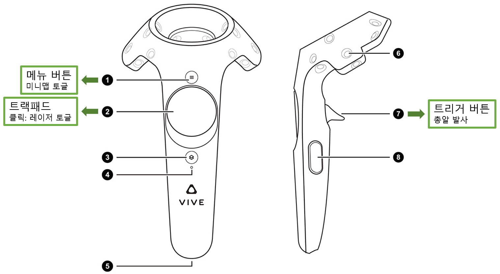
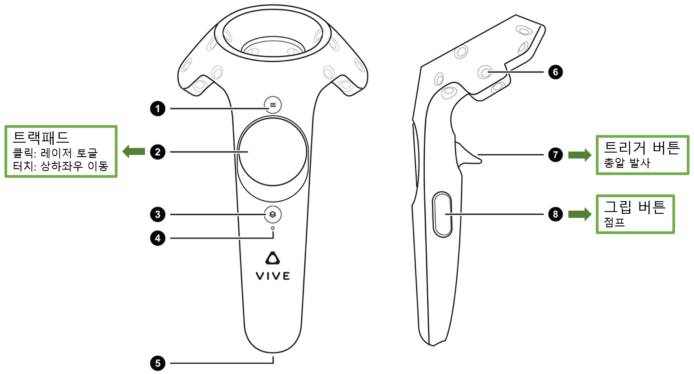
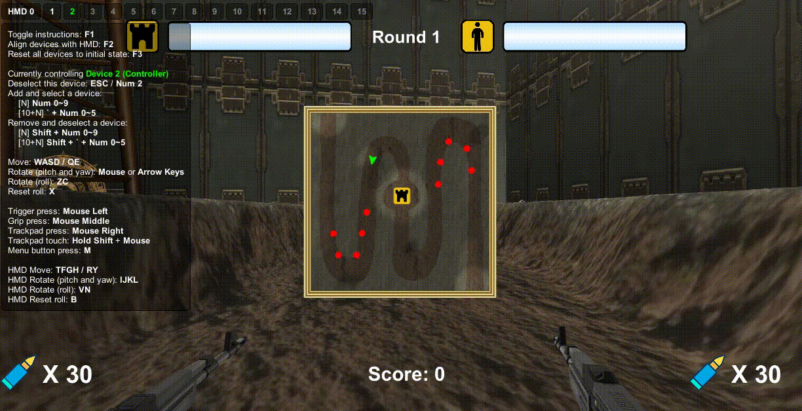
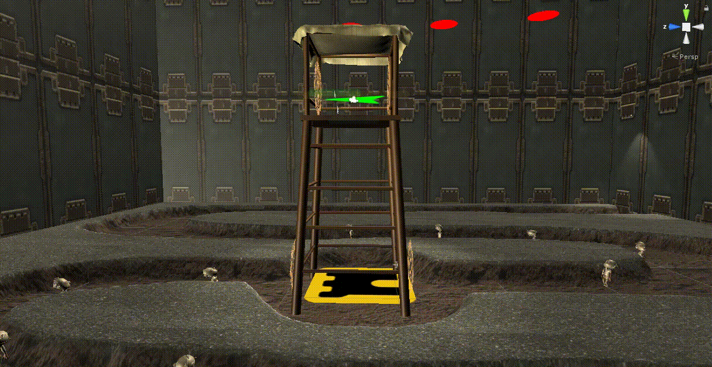
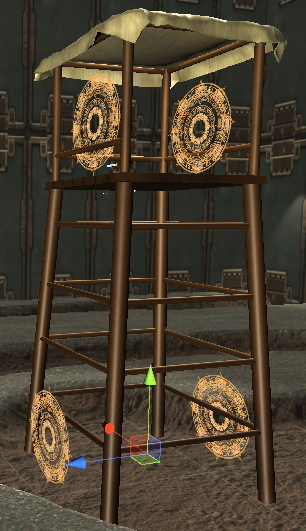
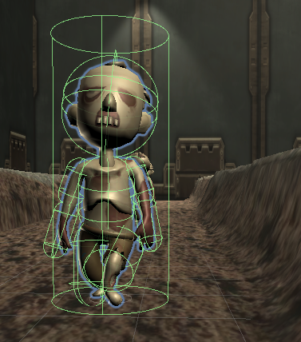
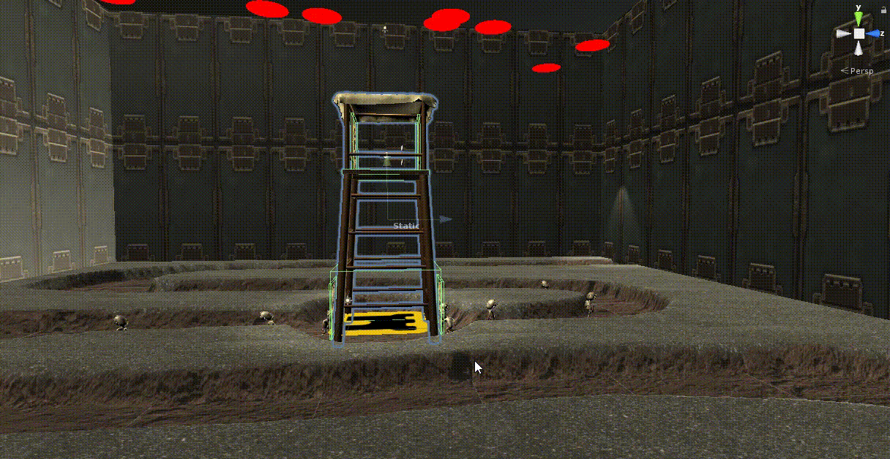

# LastShelter

> 한성대학교 이지은 교수님의 가상현실과 증강현실 강의를 듣고 제출한 최종 VR 게임 프로젝트 입니다.<br>
  타워 디펜스 로그라이크 장르입니다.

> <b>HTC VIVE</b>와 연동되며, <b>PC에서 시뮬레이션</b>할 수 있습니다.<br>
VIVE 장비를 쓰고 보는 화면과 PC에서 시뮬레이션 하는 화면이 다르기 때문에 2가지 버전으로 개발하게 되었습니다.<br>
Unity 프로젝트 생성 후 <b>LastShelter_Package_VR</b>, <b>LastShelter_Package_Simulator</b> 중 하나를 골라 import하면 됩니다.

import 방법은 다음과 같습니다.
1. 새 Unity 프로젝트 생성
2. Project 창에서 Assets/Scenes 삭제
3. 메뉴 상단바에서 Assets-Import Package-Custom Package 패키지 선택 &#10140; Import All
4. Project 창에서 Assets/Scenes/Stage 더블 클릭

VIVE를 연동하는 방법은 다음과 같습니다.
```
메뉴 상단바에서 Edit-Preferences-VIU Settings-Supporting Device ---> VIVE 체크, Add OpenVR Package
```

VIVE 키 맵핑 정보는 다음과 같습니다.
<table>
  <tr>
    <td></td>
    <td></td>
  </tr>
  <tr>
    <td>왼손</td>
    <td>오른손</td>
  <tr>
</table>

시뮬레이터를 활성화 시키는 방법은 다음과 같습니다.
```
메뉴 상단바에서 Edit-Preferences-VIU Settings-Supporting Device ---> Simulator 체크
```

시뮬레이터 키 맵핑 정보는 다음과 같습니다.
- 캐릭터 회전: ESC
- 카메라 회전: 0
- 왼손 전환: 2
  - 레이저 토글: 마우스 오른쪽 버튼 클릭
  - 미니맵 토글: m 키
  - 총알 발사: 마우스 왼쪽 버튼 클릭
- 오른손 전환: 1
  - 레이저 토글: 마우스 오른쪽 버튼 클릭
  - 상하좌우 이동: Shift + 마우스 상하좌우 드래그
  - 점프: 마우스 중간 버튼 클릭
  - 총알 발사: 마우스 왼쪽 버튼 클릭

시나리오 및 시뮬레이터 데모 영상 입니다.

<table>
  <tr><td></td></tr>
  <tr><td>
    <b>라운드가 갱신될 때 마다, 화면 상하단에서 좀비가 5초 간격으로 출현합니다.</b><br>
    최초 라운드 좀비의 수는 출현 위치당 5마리 입니다.<br>
    네비게이션 시스템을 활용하여 좀비는 공격 대상을 향해 스스로 전진합니다.<br>
    물리 법칙을 적용하였고, 사용자 파라미터에 따라 움직임을 조정할 수 있습니다.<br>
    메카님 시스템을 활용하여 좀비 애니메이션을 적용하였습니다.<br> 
    미니맵 기능을 제공합니다.<br>
  </td></tr>
</table>

<table>
  <tr><td>
    <br>
    
  </td></tr>
  <tr><td>
    <b>좀비는 공격 대상을 향해 전진하고, 대상과 충분히 가까워지면 공격합니다.</b><br>
    좀비의 공격 대상은 기본적으로 타워입니다.<br>
    플레이어와 좀비의 거리가 충분히 가까워지면 좀비의 공격 대상은 플레이어로 변경됩니다.<br>
    좀비에게 데미지를 입으면 플레이어의 HP가 감소합니다.<br>
    메카님 시스템을 활용하여 플레이어 애니메이션을 적용하였습니다.<br> 
    좀비는 길을 따라서만 이동할 수 있습니다. <br>
  </td></tr>
</table>

<table>
  <tr><td>
    
    
  </td></tr>
  <tr><td>
    <b>플레이어는 미니맵에 표시된 전체 지형을 자유롭게 이동할 수 있습니다.</b><br>
    플레이어는 점프도 할 수 있습니다.<br>
    물리 법칙을 적용하였고, 사용자 파라미터에 따라 움직임을 조정할 수 있습니다.<br>
    타워 위로 올라가거나, 아래로 내려가려면 포탈을 통과해야 합니다 .<br>
  </td></tr>
</table>

<table>
  <tr><td>
    
    
  </td></tr>
  <tr><td>
    <b>플레이어가 좀비를 제거할 때마다 스코어가 올라갑니다.</b><br>
    컨트롤러 트랙패드를 클릭하여 레이저를 활성화 합니다.<br>
    레이저 색상은 기본 녹색이며, 좀비를 겨눴을 때 빨간색으로 변경됩니다.<br>
    컨트롤러 트리거 버튼을 누르면 총알이 발사됩니다.<br>
    좀비 몸체를 크게 세 부분(Fatal Part, Normal Part, Minor Part)으로 나누어서 가해지는 데미지 양을 조절하였습니다.<br>
    좀비를 제거할 때마다 스코어는 100점 씩 올라갑니다.
  </td></tr>
</table>

<table>
  <tr><td></td></tr>
  <tr><td>
    <b>플레이어가 좀비를 모두 제거하면 다음 라운드로 넘어갑니다.</b><br>
    매 라운드 총알은 양손에 각각 30개씩 보급됩니다.<br>
    매 라운드 좀비의 수는 출현 위치 당 2마리 씩 추가됩니다.
  </td></tr>
</table>

<table>
  <tr><td>
    <br>
    
  </td></tr>
  <tr><td><b>타워가 파괴되거나, 플레이어가 사망하면 게임이 종료됩니다.</b></td></tr>
</table>
